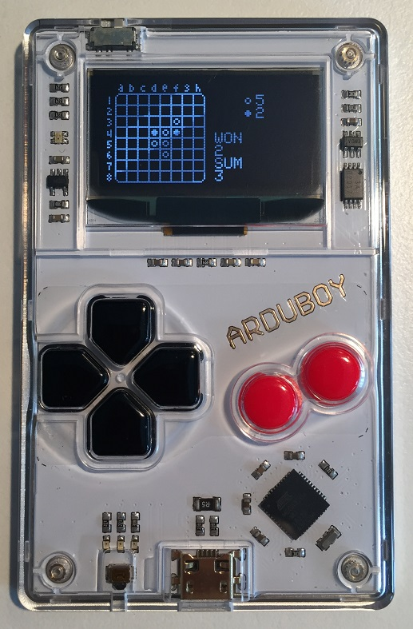

# Pocket Othello

**Copyright (C) 2017 [Wang Renxin](https://github.com/paladin-t/). All rights reserved.**

 This work is licensed under a <a rel="license" href="http://creativecommons.org/licenses/by-sa/4.0/">Creative Commons Attribution-ShareAlike 4.0 International License</a>.

## Introduction

Pocket Othello is an Othello game for the Arduboy.

## Installation

### 1. Use the HEX

* Use an Arduboy HEX uploader to upload the `/hex/pocket_othello.hex` to your Arduboy.

### 2. Use the sketch

* Make sure you have the Arduino IDE installed and the Arduboy board package installed and selected.
* Open the `/pocket_othello/pocket_othello.ino` sketch with the Arduino IDE.
* Compile and upload the sketch.
